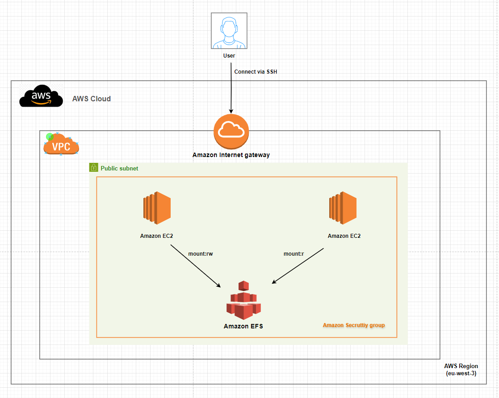

# Topic 3 - Shared FS between 2 servers(EC2+EFS)
##  Yuanchao Hands-on Project

## This readme is more readable [here](https://github.com/lyc-handson-aws/handson-topic3)

## **Overview**

**Project's main features**
:point_right: 2 servers share one mounted file system

:point_right: one server can write/read on shared file system

:point_right: one server can only read on shared file system

:point_right: 2 servers are publicly accessible via SSH

## **Architecture**
the diagram below illustrates the architecture(principle) of this project:

## Continue Deployment
CloudFormation stack's deployment: see GitHub workflows https://github.com/lyc-handson-aws/handson-topic3/blob/main/.github/workflows/action-cf.yaml

## **CloudFormation Stack Quick-create Link**
Click here to quickly create a same project with the same AWS resources:  [here](https://eu-west-3.console.aws.amazon.com/cloudformation/home?region=eu-west-3#/stacks/create/review?templateURL=https://s3bucket-handson-topic1.s3.eu-west-3.amazonaws.com/CF-template-handson-topic3.yaml)
**See Stack's description for complete actions to reproduce the same project**

**in this stack, you need to provide your own VPC/SUBNET/SUCRURITY/SSHKEY on AWS**

> the default stack's region "Europe (Paris) eu-west-3"

## **AWS Resources**
Project's AWS resources:

:point_right: AWS::EC2 - 2 EC2, 2 InstanceProfile, 1 SecurityGroup for servers/EFS instance

:point_right: AWS::IAM::Role - define 2 roles, one has only read permission on EFS , one has read/write permission on EFS

:point_right: AWS::EFS
- AWS::EFS::FileSystem - define EFS instance
- AWS::EFS::AccessPoint - define the default user/default new file's owner/default mount path
- AWS::EFS::MountTarget - bind subnet/security group

